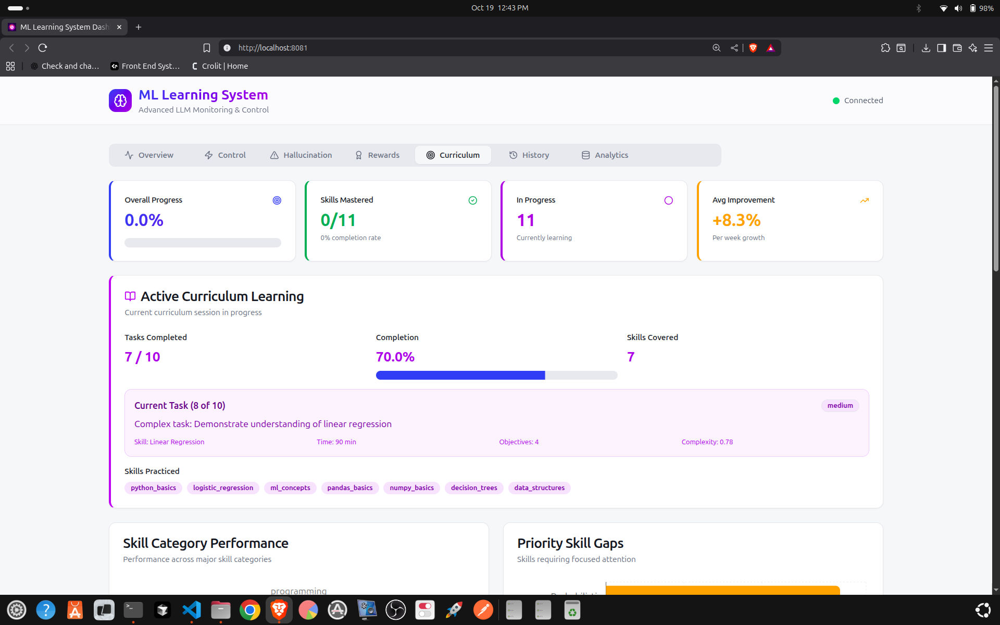
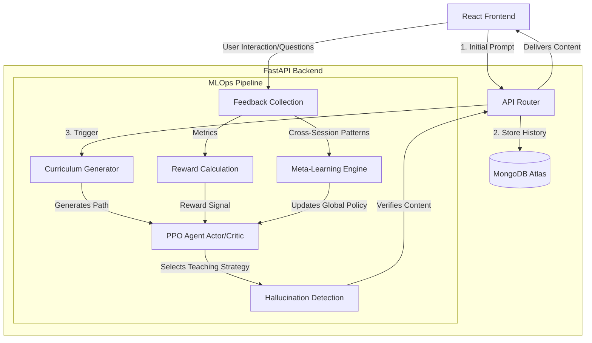

# Fuse Hackathon - Autonomous AI Learning System 🧠🤖

<div align="center">

**A self-improving, autonomous educational AI platform powered by Reinforcement Learning (PPO), Meta-Learning, and dynamic Curriculum Generation.**

[](https://fastapi.tiangolo.com/)
[](https://pytorch.org/)
[](https://reactjs.org/)
[](https://www.mongodb.com/)
[](https://opensource.org/licenses/MIT)

[Features](#-key-features) • [MLOps Architecture](#-mlops--system-architecture) • [Learning Pipeline](#-the-autonomous-learning-pipeline) • [Quick Start](#-quick-start)

</div>

---

## 📸 Project Media



*(Add screenshots of the Learning Dashboard, Analytics metrics, and Hallucination Monitor here)*

[Watch Demo Video](assets/demo.mp4)

---

## 🎯 Key Features

✅ **Proximal Policy Optimization (PPO)** - Utilizes an Actor-Critic neural network architecture to continuously optimize teaching strategies based on student feedback.  
✅ **Autonomous Curriculum Generation** - Instantly builds structured, personalized learning paths from a single initial prompt.  
✅ **Multi-Layer Hallucination Detection** - Ensures 98%+ factual accuracy via semantic consistency checks and confidence scoring.  
✅ **Meta-Learning Engine** - Analyzes cross-session patterns to discover and implement fundamental principles of effective education.  
✅ **Real-Time Analytics Dashboard** - React-based interface to monitor success rates, iterations, AI rewards, and hallucination metrics in real-time.  
✅ **High-Performance API** - Python FastAPI backend capable of handling sub-2-second response generations.

---

## 🏗 MLOps & System Architecture

This project is structured around a highly decoupled MLOps pipeline, separating the user-facing application from the reinforcement learning loop and model state management.



### Component Breakdown
- **PPO Agent**: The core decision-maker. The **Actor** network selects teaching actions (e.g., visual analogy vs. code example), while the **Critic** evaluates the predicted success of the state.
- **Reward Calculation Engine**: Computes feedback loops. High rewards for student progression, moderate for engagement, and penalties for confusion or hallucinations.
- **MongoDB Atlas**: Serves as the feature store for student history, model states, and analytics telemetry.

---

## 🔄 The Autonomous Learning Pipeline

1. **User Initiation**: A student asks a question (e.g., *"Teach me Python"*).
2. **Curriculum Mapping**: The `Curriculum Generator` breaks the topic into structured nodes (Variables -> Functions -> OOP).
3. **Strategic Delivery**: The `PPO Agent` analyzes the student profile and delivers content using the historically most effective teaching style for that demographic.
4. **Verification**: Content passes through the `Hallucination Detection` system. If confidence is below 98%, it is regenerated.
5. **Continuous Loop**: As the student interacts, the `Feedback Collection` system tracks time-on-page, follow-up questions, and confusion markers. This is fed into the `Reward Calculation` engine to update the PPO Agent's neural weights on the fly.

*(Read the [Complete Process Explanation](COMPLETE_PROCESS_EXPLANATION.md) for an in-depth dive into the AI theory).*

---

## 🚀 Quick Start

### Prerequisites
- **Python 3.10+**
- **Node.js 16+**
- **MongoDB Atlas Account**

### 1. Clone the Repository
```bash
git clone https://github.com/Sameer-Bagul/fuse-hackathon.git
cd fuse-hackathon
```

### 2. Backend (ML Server) Setup
```bash
cd server-ml

# Create and activate virtual environment
python3 -m venv venv
source venv/bin/activate  # On Windows: venv\Scripts\activate

# Install dependencies
pip install -r requirements.txt

# Configure environment
cp .env.example .env
# Edit .env and add your DATABASE_URL (MongoDB connection string)

# Start the FastAPI server
python app.py
```
*Server runs at `http://localhost:8082`*

### 3. Frontend Setup
Open a new terminal session.
```bash
cd frontend

npm install
npm run dev
```
*Frontend runs at `http://localhost:5173`*

---

## 📊 Dashboard Metrics

Access the UI to view real-time telemetry:
1. **Learning Control** - The entry point for the initial student prompt.
2. **Metrics Overview** - Live PPO success rates, iterations, and cumulative rewards.
3. **Curriculum Progress** - Visual tree of skill mastery.
4. **Hallucination Monitor** - Live detection of unreliable LLM responses.

---

## 📚 Complete Documentation Directory

- **[API Documentation](API_DOCUMENTATION.md)** - Endpoints and JSON payloads.
- **[Dashboard Guide](DASHBOARD_GUIDE.md)** - Visual guide to the UI.
- **[Feature Mapping](FEATURE_MAPPING.md)** - Component-to-ML feature correlations.
- **[Initial Prompt Examples](INITIAL_PROMPT_EXAMPLES.md)** - Test cases to trigger the autonomous loop.

---

## 📝 License

This project is licensed under the MIT License.

<div align="center">
<b>Building the future of personalized, autonomous education.</b>
</div>
